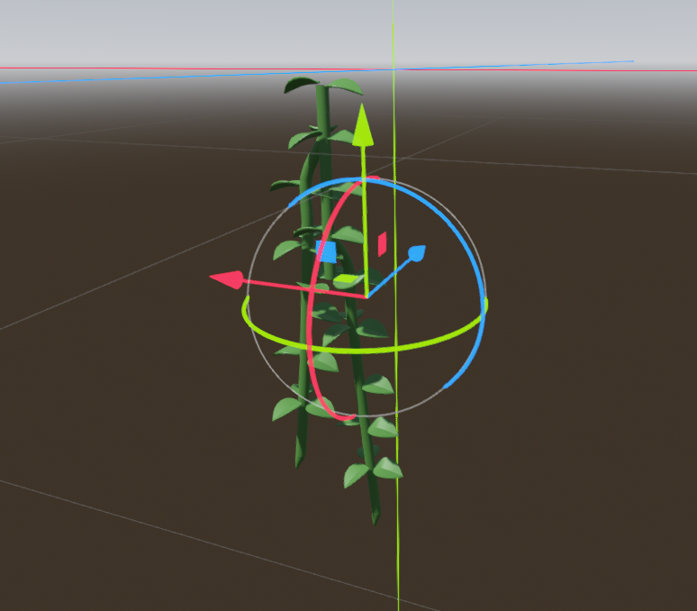
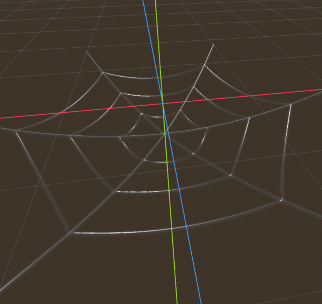

# Halyard: A Fast Verlet Rope Library

A high-performance, cross-platform rope simulation library using the Verlet integration method. For when you need rope, and you need it quickly.


## Features

- Fast rope physics using Verlet integration.
- Supports arbitrary rope attachment points and anchors for complex rigging.
- Configurable rope length, stiffness, and segment count.
- Limitted collision detection and response.
	- Bodies can collide with rope, modelled as a capsule chain.
	- Rope can collide with bodies, but is modelled as points.
- Apply forces to an anchor with the _PullRope_ class.
- Dynamically resize rope length for creating hoists.
- Render rope as a mesh tube or as individual chain links.
- Endcap and attachment support for rope details.
- TODO:
	- ~~External RigidBodies can apply forces to ropes~~
	- ~~Ropes can be infinitely stiff, like in metal chains~~
	- ~~PullRopes can transfer forces through anchors~~
	- ~~Ropes preserve their orientation through anchors~~
	- ~~Rope positions can specify their own Basis~~

The attachment system can used to create complicated rigging arrangements like cargo nets, spider webs and ratlines.
The anchors can be used to create the illusion of pulleys.


## Installation

0. Install the build tools for your platform, same as you would for building godot.
	See: https://docs.godotengine.org/en/stable/contributing/development/compiling/introduction_to_the_buildsystem.html

1. Clone the repository to your addons folder:
	```sh
	git clone https://github.com/mikest/halyard.git
	```
2. Initialize the submodules:
	```sh
	git submodule update --init --recursive
	```
3. Build the library using SCons or CMake:
	```sh
	scons compiledb=yes
	```
    or for debug builds...
	```sh
	scons dev_build=yes compiledb=yes template_debug=yes
	```
4. Reload your project.

## Usage

1. Import the library into your project.
	- NOTE: On 4.3 you may encounter errors related to SVG images on the first load. It should succeed on the second load.
	- NOTE: On OSX you will have to work through explicitly allowing the dylibs to open.
	- NOTE: One Windows you may also need to do this.
	- You can avoid this by building from source. The repo is designed to be checked out directly into your addons folder for this reason.
2. Open the example scene and look around.
2. Create a rope instance and configure its parameters.
3. Attach rope ends to objects or positions. Rope details will be scaled to rope width, so model your attachments at 1:1 for a 1m thick rope.

## Demo

See `example.tscn` for an example of using this library to generate ship _ratlines_.


You can also find a variety of tests that demonstrate different capabilities in the `tests folder.

Some examples:
- `anchor_test.tscn`: Anchor placement.
- `attachment_test.tscn`: Various attachment behaviors.
- `chain_test.tscn`: Testing out chain link rendering.
- `pull_test.tscn`: Test out the `PullRope` class with an offset anchor on a RigidBody
- `stretch_test.tscn`: Test out stretching behaviors
- `swing_test.tscn`: Test out a pair of PullRopes pulling on a RigidBody3D.
- `vine_test.tscn`: Test out chaining ropes together in branching structures.

- `web_test.tscn`: Test out weaving multiple ropes together with shared anchor and attachment resources.



## Documentation

- API reference: See the built in documentation for the classes.
- Build instructions: See `SConstruct`

## Contributing

Pull requests and issues are welcome! Please see `CONTRIBUTING.md` for guidelines.

## License

This project is licensed under the MIT License. See `LICENSE.md` for details.