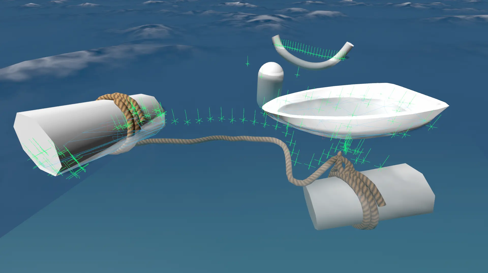
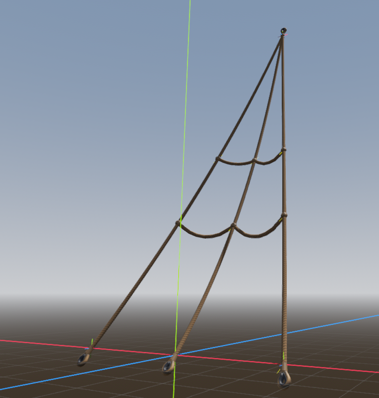

# Halyard: A Fast Verlet Rope Library

A high-performance, cross-platform rope simulation library using the Verlet integration method. For when you need rope, and you need it quickly.



## Features

- Fast rope physics using Verlet integration.
- Supports arbitrary rope attachment points and anchors.
- Configurable rope length, stiffness, and segment count.
- ~~Collision detection and response~~
- Endcap and attachment support for rope details.
- Demo scene and example textures and meshes included.



The attachment system can used to create complicated rigging arrangements like cargo nets, spider webs and ratlines.
The anchors can be used to create the illusion of pulleys.

## Installation

0. Install the build tools for your platform, same as you would for building godot.
	See: https://docs.godotengine.org/en/stable/contributing/development/compiling/introduction_to_the_buildsystem.html

1. Clone the repository to your addons folder:
	```sh
	git clone https://github.com/mikest/halyard.git
	```
2. Build the library using SCons or CMake:
	```sh
	scons compiledb=yes
	```
    or for debug builds...
	```sh
	scons dev_build=yes compiledb=yes template_debug=yes
	```
3. Reload your project.

## Usage

1. Import the library into your project.
2. Open the example scene and look around.
2. Create a rope instance and configure its parameters.
3. Attach rope ends to objects or positions. Rope details will be scaled to rope width, so model your attachments at 1:1 for a 1m thick rope.

## Demo

See `example.tscn` for usage.

## Documentation

- API reference: See `doc_classes/`
- Build instructions: See `SConstruct`

## Contributing

Pull requests and issues are welcome! Please see `CONTRIBUTING.md` for guidelines.

## License

This project is licensed under the MIT License. See `LICENSE.md` for details.