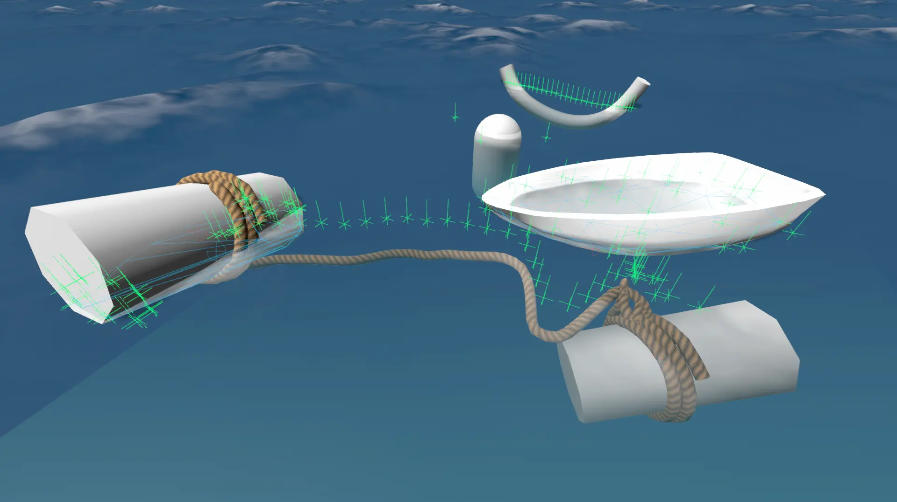
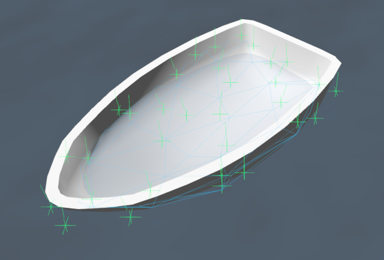
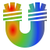
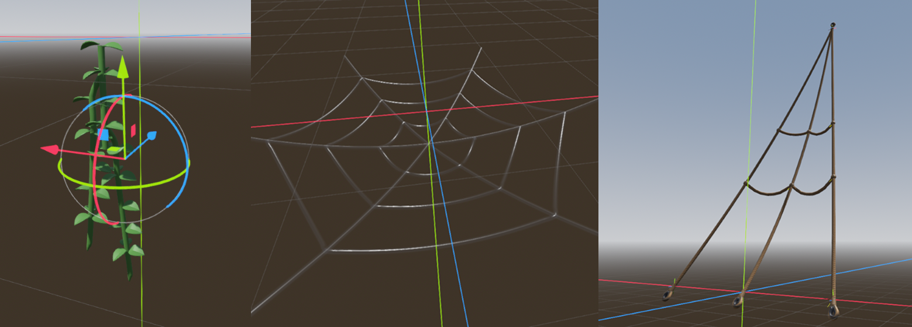

# Halyard: A Fast Verlet Rope and Volume Buoyancy Library

A high-performance, cross-platform rope & buoyancy simulation library. For all your nautical game needs.



## Features

### Rope
- Fast rope physics using Verlet integration.
- Supports arbitrary rope attachment points and anchors for complex rigging.
- Configurable rope length, stiffness, and segment count.
- Automatic force feedback to attached RigidBody3D objects for realistic physics interactions.
- Tunable force scaling and clamping for stability control.
- Limitted collision detection and response.
	- Bodies can collide with rope, modelled as a capsule chain (GodotPhysics3D only).
	- Rope can collide with bodies, but is modelled as points.
- Dynamically resize rope length for creating hoists.
- Render rope as a mesh tube or as individual chain links.
- Endcap and attachment support for rope details.
- LOD scaling of generated rope mesh.
- Smoothing of generated rope curve.

The attachment system can used to create complicated rigging arrangements like cargo nets, spider webs and ratlines.
The anchors can be used to create the illusion of pulleys.


### Buoyancy


- Custom liquid heightmap sampling
- Axis-independent drag, for simulating boat hulls.
- Submerged mesh volume estimation.
- CharacterBody3D & RigidBody3D buoyancy components.
- Built-in Rope buoyancy.
- Optional Auto-calculation of mass properties.


### Classes
-  Rope - A virtual rope that can react to gravity, wind and waves.
-  RopeAnchor - An anchor point that attaches, guides, or tows via a rope.
-  CoiledAnchor - A RopeAnchor that generates coil/helix positions, for modelling rope wound around a drum or winch.
-  RopeAppearance - A resource for describing the look of a Rope and its Attachments.

-  RigidBuoyancy - A component that makes its parent RigidBody3D float.
-  CharacterBuoyancy - A component that makes its parent CharacterBody3D float.
-  LiquidArea - An abstract representation of a liquid surface. Some assembly required...


## Installation
0. Install the build tools for your platform, same as you would for building godot.
	See: https://docs.godotengine.org/en/stable/contributing/development/compiling/introduction_to_the_buildsystem.html

1. Clone the repository to your addons folder:
	```sh
	git clone https://github.com/mikest/halyard.git
	```
2. Initialize the submodules:
	```sh
	git submodule update --init --recursive
	```
3. Build the library using SCons or CMake:
	```sh
	scons
	```
    or for debug builds...
	```sh
	scons template_debug=yes
	```
4. Reload your project.


## Basic Usage
1. Import the library into your project.
	- NOTE: On 4.3 you may encounter errors related to SVG images on the first load. It should succeed on the second load.
	- NOTE: On OSX you will have to work through explicitly allowing the dylibs to open.
	- NOTE: One Windows you may also need to do this.
	- You can avoid this by building from source. The repo is designed to be checked out directly into your addons folder for this reason.
	- Jolt Physics has some caveats around collisions.
2. Open the example scene and look around.
2. Create a rope instance and configure its parameters.
3. Attach rope ends to objects or positions. Rope details will be scaled to rope width, so model your attachments at 1:1 for a 1m thick rope.


## Rope Force Feedback
Ropes automatically apply tension forces to attached `RigidBody3D` objects through `RopeAnchor`s, enabling realistic physics interactions.

See `FAQ.md` for more troubleshooting tips.


## Demo
See `example.tscn` for an example of using this library to generate ship _ratlines_.

You can also find a variety of tests that demonstrate different capabilities in the `tests folder.



Some examples:
- `anchor_test.tscn`: Anchor placement.
- `attachment_test.tscn`: Various attachment behaviors.
- `buoyancy_test.tscn`: Various buoyancy examples.
- `chain_test.tscn`: Testing out chain link rendering.
- `coil_test.tscn`: Test out the `CoiledAnchor` class for modelling rope on a drum.
- `pull_test.tscn`: Test out an offset anchor on a RigidBody.
- `stretch_test.tscn`: Test out stretching behaviors
- `swing_test.tscn`: Test out a pair of anchors pulling on a RigidBody3D.
- `vine_test.tscn`: Test out chaining ropes together in branching structures.
- `web_test.tscn`: Test out weaving multiple ropes together with shared anchor and attachment 
resources.
- others...


## Documentation
- API reference: See the built in documentation for the classes.
- Build instructions: See `SConstruct`

### Roadmap
Here's some things I'd like to add to this library in the fullness of time.

#### Rope
- Rope uses real mass properties
- Full bidirectional collision support
- Rope twist torque.
- Optional torque application at attachment offset points

#### Buoyancy
- Use compute shader for buoyancy mesh volume integrator.
- Clean up Ocean wandering clipmap and use compute shader for liquid sampling.
- Heightmap & current vector map for ocean so we can stick to the rivers and the lakes that we're used to.

#### Wind/Sails
- Softbody sail pattern generator.
- Wind/Sail force applicator.


## Contributing
Pull requests and issues are welcome! Please see `CONTRIBUTING.md` for guidelines.


## License
This project is licensed under the MIT License. See `LICENSE.md` for details.
